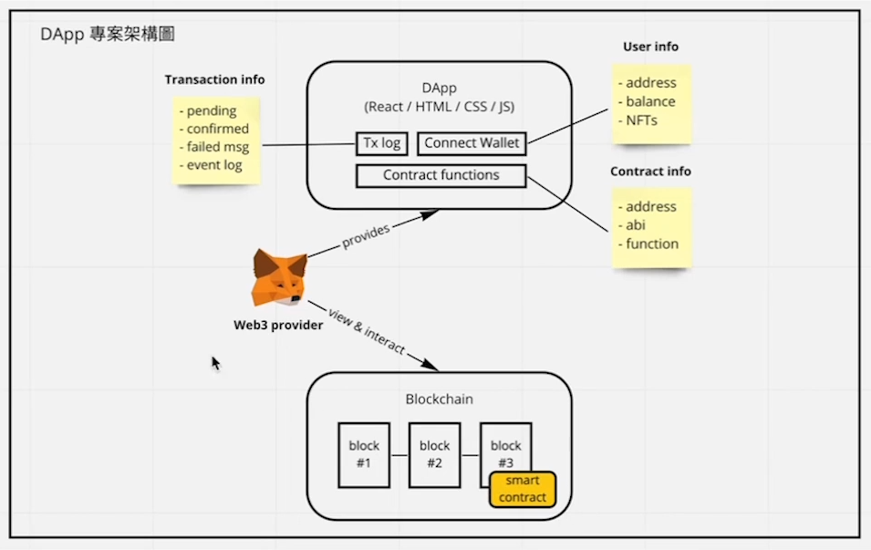
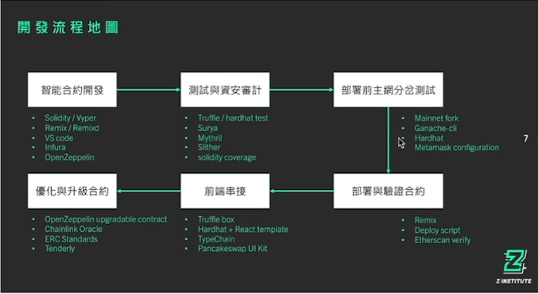

## Chapter 2 DApp 開發基礎

### 最簡單的專案架構概覽

connect wallet 成功連接錢包可以拿到用戶資訊

User info

- address
- balance
- NFTs

Tx log(Tx是Transaction縮寫)

Transaction info

- pending 交易還沒確認
- confirmed 交易已被確認
- failed msg 交易失敗訊息
- event log 交易當中有執行事情會顯示事件訊息

Contract fucntions 指定跟哪個合約互動 

Contract info

- address
- abi
- function

Web3 provider(Metamask) 去跟DApp和Blockchain做互動

- 智能合約開發

    - Vyper 智能合約語言，比較像python的寫法
    - INFURA 節點
    - OpenZepplin 函式庫

- 測試與資安審計

    - hardhat 測試智能合約
    - solidity-coverage 測試涵蓋率，好的智能合約測試覆蓋率約85%以上
    - surya 產生合約繼承圖
    - Mythril 資安測試工具
    - Slither 資安測試工具(常見錯誤)

- 部屬前主網分岔測試

    - Ganache-cli localhost測試網

- 部署與驗證合約

    Verify 想讓大家可以看到妳的合約程式碼
    - hardhat plugin: hardhat-etherscan

- 前端串接

    - Truffle Box 快速創建DApp模板
    - TypeChain
    - tenderly 查看交易的詳細資訊，在debug好用

